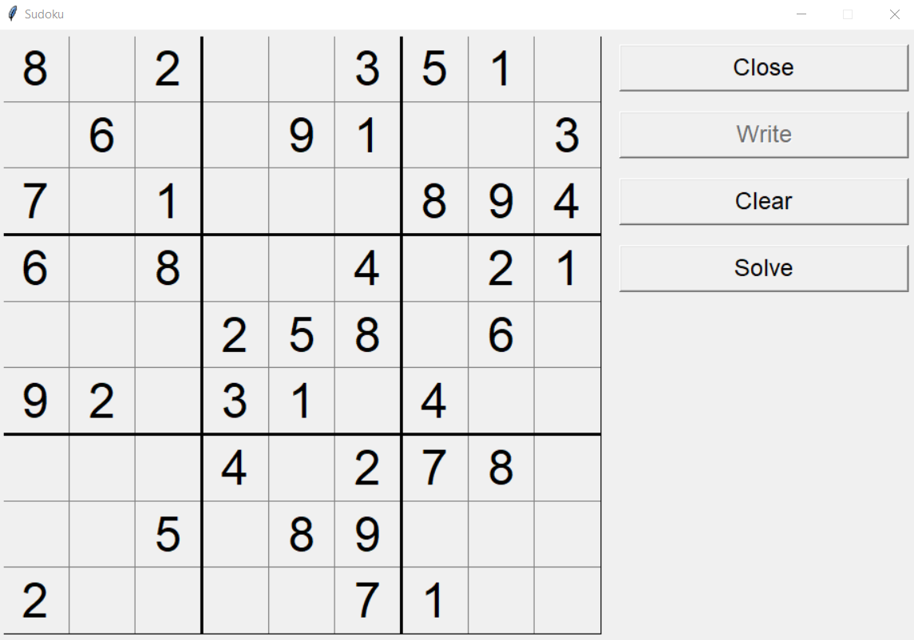

# Overview

This project is capable of solving a Sudoku puzzle using a genetic algorithm. Puzzle configurations can be read in from a plain text file containing a string of 9 x 9 digits separated by spaces, with some examples provided in the folder `example_sudokus`. Zero is used to represent an unknown digit, whereas numbers in [1, 9] are assumed to be known/given.

### Instructions

First of all, make sure you have python, tkinter and numpy installed locally. Then clone or download this repository 

**Downloading and executing:**

```git
git clone https://github.com/binh234/genetic_sudoku.git
```

Run the code by executing `python main.py` at the command line.


**Using the program**



*Open button* : Load a Sudoku puzzle from a file  
*Write button* : Enable you to enter your own Sudoku puzzle to the board  
*Clear button* : Clear the current Sudoku puzzle  
*Solve/Cancel button* : Start/Stop solving Sudoku puzlle using genetic algorithm

## License

[MIT](./LICENSE)